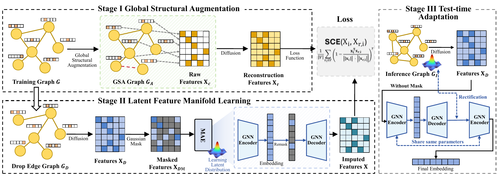

# DART

## Mitigating Structural Overfitting: A Distribution-Aware Rectification Framework for Missing Feature Imputation

[](./DART.pdf)
[](./DART.pdf)
[](./LICENSE)

Official implementation of **DART**, accepted by **SIGIR 2026**.

DART studies missing feature imputation on graphs from the perspective of **structural overfitting**. The framework combines:

- **Global Structural Augmentation (GSA)** to bridge disconnected components.
- **Self-supervised manifold learning** to recover semantic diversity from structurally smoothed features.
- **Test-time distribution rectification** to correct the inductive distribution shift caused by unseen graph structures.

The repository currently includes the paper PDF and the full training / evaluation code for:

- Transductive node classification
- Inductive node classification
- Link prediction

<p align="center">
  <a href="./assets/dart_overview.pdf">
    
  </a>
</p>

The overview figure above links to the original vector version in [assets/dart_overview.pdf](./assets/dart_overview.pdf).

## News

- `2026-04-03`: DART was accepted by SIGIR 2026.
- `2026-04-03`: Initial code and paper PDF are available in this repository.

## Highlights

- We identify **structural overfitting** as a core limitation of diffusion-based missing-feature imputation.
- We propose a **three-stage framework**: GSA, manifold learning, and test-time rectification.
- We benchmark on **six public datasets** plus **Sailing**, a real-world dataset with naturally missing features.
- DART consistently improves over strong baselines in both **transductive** and **inductive** settings.

## Main Results

Selected results from the paper are listed below. Full tables are available in [the paper PDF](./DART.pdf).

| Task | Dataset | Setting | Previous Best | DART |
| --- | --- | --- | --- | --- |
| Node Classification | Cora | Transductive, uniform 90% missing | `76.68` (PCFI) | **`79.48`** |
| Node Classification | Sailing | Transductive, natural missing | `68.45` (PCFI) | **`70.88`** |
| Node Classification | Reddit | Inductive, uniform 90% missing | `86.77` (PaGNN) | **`93.88`** |
| Node Classification | Sailing | Inductive, natural missing | `64.85` (PaGNN) | **`77.56`** |
| Link Prediction | Cora | Uniform 90% missing, AUC / AP | `86.65 / 89.21` (FP) | **`94.62 / 94.28`** |
| Link Prediction | Sailing | Natural missing, AUC / AP | `97.97 / 97.80` (PCFI) | **`98.52 / 98.38`** |

## Repository Layout

```text
.
├── assets
│   ├── dart_overview.pdf
│   └── dart_teaser.png
├── DART.pdf
├── LICENSE
├── README.md
└── src
    ├── configs
    │   ├── configs_transductive.yml
    │   ├── configs_inductive.yml
    │   └── configs_link.yml
    ├── models
    ├── scripts
    ├── data_loading.py
    ├── node_classification_transductive.py
    ├── node_classification_inductive.py
    └── link_prediction.py
```

The actual training code lives in [`src/`](./src).

## Environment

The codebase was tested with the following core dependencies:

- `python>=3.10`
- `torch==2.1.2`
- `torch_geometric==2.5.3`
- `torch-scatter`
- `torch-sparse`
- `dgl==2.2.1`
- `ogb==1.3.6`
- `pyyaml==6.0.1`
- `numpy`, `scipy`, `scikit-learn`, `networkx`, `tensorboardX`, `tqdm`

Because `torch-scatter`, `torch-sparse`, and `dgl` require version-matched wheels, we recommend installing them by following the official installation pages for your exact **PyTorch + CUDA** setup. The experiments in this repo were configured for **PyTorch 2.1 / CUDA 11.8**.

A minimal environment setup looks like:

```bash
conda create -n dart python=3.10 -y
conda activate dart

pip install torch==2.1.2
pip install torch_geometric==2.5.3 ogb==1.3.6 pyyaml==6.0.1 scipy scikit-learn networkx tensorboardX tqdm
# install torch-scatter, torch-sparse, and dgl with wheels matching your CUDA / PyTorch version
```

## Dataset Preparation

### Automatically downloaded datasets

The following datasets are loaded directly from DGL / OGB:

- `cora`
- `citeseer`
- `pubmed`
- `ogbn-arxiv`

### Locally prepared datasets

For `flickr`, `reddit`, and `sailing`, please prepare the data under:

```text
src/dataset/<dataset_name>/
├── adj_full.npz
├── feats.npy
├── class_map.json
└── role.json
```

Notes:

- `Sailing` uses **naturally missing** features.
- Public datasets use **synthetic missingness** according to the settings in the config files.
- If you plan to open-source the Sailing dataset later, this is the section where a direct download link or preprocessing script should be added.

## Quick Start

All commands below assume you are at the repository root:

```bash
cd src
```

### Transductive node classification

```bash
bash scripts/node_classification_transductive.sh cora 0
```

### Inductive node classification

```bash
bash scripts/node_classification_inductive.sh flickr 0
```

### Link prediction

```bash
bash scripts/link_prediction.sh cora 0
```

The scripts automatically load the best hyper-parameters from:

- `configs/configs_transductive.yml`
- `configs/configs_inductive.yml`
- `configs/configs_link.yml`

## Supported Tasks and Datasets

| Task | Datasets |
| --- | --- |
| Transductive node classification | `cora`, `citeseer`, `pubmed`, `ogbn-arxiv`, `sailing` |
| Inductive node classification | `flickr`, `reddit`, `sailing` |
| Link prediction | `cora`, `citeseer`, `pubmed`, `ogbn-arxiv`, `flickr`, `reddit`, `sailing` |

## Citation

If you find this repository useful, please cite:

```bibtex
@inproceedings{song2026dart,
  title={Mitigating Structural Overfitting: A Distribution-Aware Rectification Framework for Missing Feature Imputation},
  author={Song, Yifan and Yu, Fenglin and Luo, Yihong and Tao, Xingjian and Qiu, Siya and Han, Kai and Tang, Jing},
  booktitle={Proceedings of the International ACM SIGIR Conference on Research and Development in Information Retrieval},
  year={2026}
}
```

## Acknowledgements

Parts of the graph masked autoencoder implementation are adapted from prior THUDM open-source code released under the MIT License. See [THIRD_PARTY_NOTICES.md](./THIRD_PARTY_NOTICES.md) for attribution details.

## Contact

For questions or collaborations, please open an issue or contact the authors listed in [the paper](./DART.pdf).
